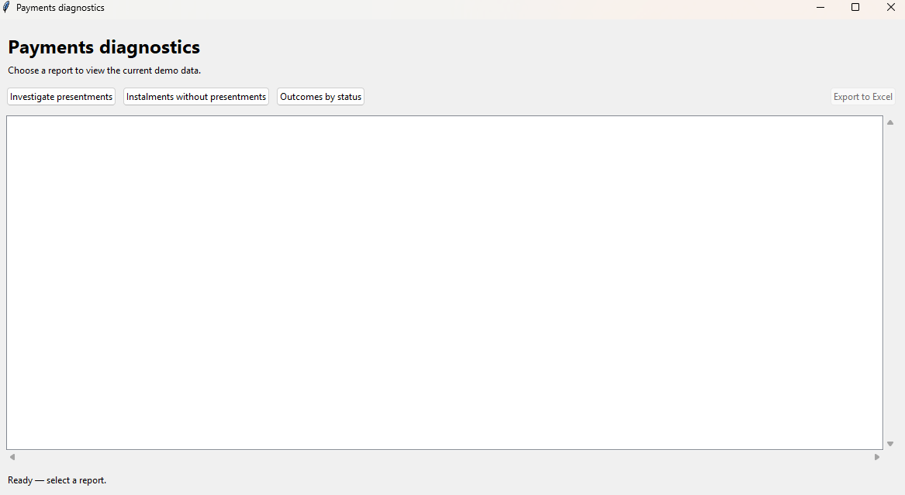
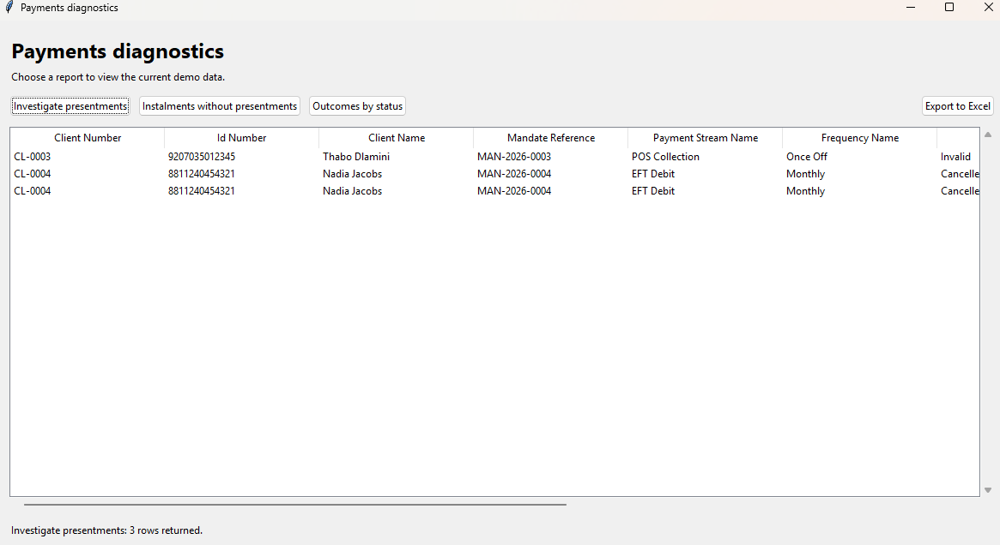
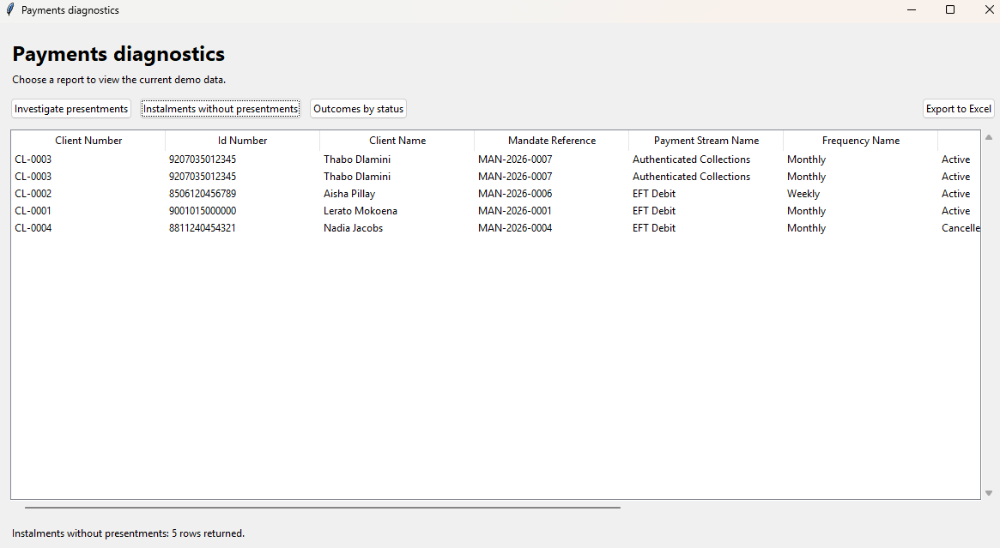
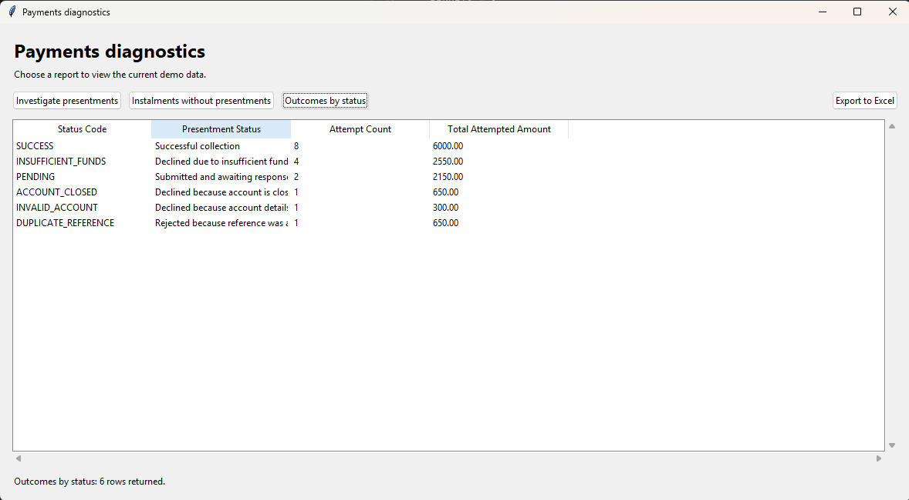

# Payments Operations Technical Demo

An ongoing personal learning project connecting payments operations experience with practical PostgreSQL, SQL and Python investigation skills. It is being developed incrementally and is not a finished application.

## Current Scope

- A PostgreSQL schema modelling clients, mandates, instalments and payment presentments, with lookup tables for payment streams, frequencies and statuses.
- Synthetic sample data covering different payment and instalment outcomes.
- An investigation query joining payment attempts to their client, mandate and instalment context, filtered to statuses marked as requiring investigation.
- A Python runner that displays investigations and exports them to Excel, with database error handling.
- Architecture documentation and a changelog recording development progress.

The scenario follows a debit-order collection workflow: a client has a mandate, the mandate has scheduled instalments, and presentments record collection attempts. The aim is to practise tracing payment outcomes through related records and interpreting their operational context.

## Implemented Files

```text
ops-technical-demo/
|-- README.md
|-- CHANGELOG.md
|-- python/
|   |-- report_gui.py
|   |-- diagnostics.py
|   |-- requirements.txt
|-- sql/
|   |-- schema.sql
|   |-- sample_data.sql
|   |-- investigate_presentments.sql
|   |-- instalments_without_presentments.sql
|   |-- outcomes_by_status.sql
|-- docs/
    |-- architecture.md
```

## Run the Current Demo

Install PostgreSQL and make its command-line tools available on your PATH. Run the following from the repository root, using your local PostgreSQL connection settings:

```powershell
createdb ops_demo
psql -v ON_ERROR_STOP=1 -d ops_demo -f sql/schema.sql
psql -v ON_ERROR_STOP=1 -d ops_demo -f sql/sample_data.sql
psql -v ON_ERROR_STOP=1 -d ops_demo -f sql/investigate_presentments.sql
```

Use a dedicated demo database: `schema.sql` drops and recreates the demo tables. All sample data is synthetic; this project should not be connected to production systems or real customer data.

See [architecture documentation](docs/architecture.md) for table relationships and a Windows executable-path example.

## Run the Python Report

The current script was developed with Python 3.14.6. Its f-string syntax requires Python 3.12 or newer; the recorded package versions are from the working Windows Python 3.14 environment.

From the repository root in PowerShell, create an environment if one does not already exist, then install the recorded dependencies:

```powershell
python -m venv .venv
.\.venv\Scripts\python.exe -m pip install -r python/requirements.txt
.\.venv\Scripts\python.exe python/diagnostics.py
```

For an existing project environment, skip the first command. In PyCharm, select `.venv\Scripts\python.exe` as the project interpreter and run `python/diagnostics.py`.

PostgreSQL must be running and the schema and sample data must already be loaded. The connection settings in `connect_to_database()` currently target `127.0.0.1:5432`, database `ops_demo`, user `postgres`, with a five-second connection timeout. Adjust these for your own local demo. The script supplies no password; authentication must be configured for that account, for example through PostgreSQL's password file. Do not put passwords in tracked source files.

The console runner displays all columns returned by the selected query and saves them to `report.xlsx`, on a `Report` worksheet. Column headings come from the result dictionaries. The current selection in `main()` is `investigate_presentments.sql`; change the filename passed to `fetch_report()` to run another report. The workbook is saved in the process working directory, which can differ between PyCharm and terminal runs. Empty results display a message and skip export; any existing workbook is left unchanged.

Each export overwrites the same filename. Close the workbook in Excel before rerunning. File-write errors are not currently handled with a custom message; database connection and query errors are reported with exit code 1. The connection is closed in `finally` after the query/report stage, including on failure.

## Planned Work

- Extend the diagnostic SQL with further operations investigation scenarios.
- Add VM/RDP setup and further troubleshooting notes.

These items are planned and are not implemented in the current repository. The current demonstration can run directly through SQL or through the Python report runner.

## Desktop report GUI (AI-generated)

The basic Tkinter GUI in `python/report_gui.py` was generated by Codex on the
`ai-generated/basic-report-gui` branch. The original learning script remains
`python/diagnostics.py`.

Run from the repository root with the existing dependencies installed:

```powershell
.\.venv\Scripts\python.exe python/report_gui.py
```

One button runs each report: investigations, instalments without presentments,
and outcomes by status. Results appear in a scrollable table with headings taken
from the query. Export to Excel saves the displayed results to a chosen file;
empty reports export headings only. Reports run in a background thread so the
window stays responsive. Failed reports clear the previous results and show an
error; report buttons become available again.

The GUI uses the same local database settings as the learning script, opens a
read-only connection per report, and closes it after fetching. Connection attempts
have a five-second timeout and statements a fifteen-second timeout. Tkinter is
included with standard Windows Python installations; no new pip dependency is
required. Only the three explicitly listed report files can run from the GUI.

## GUI screenshots

These screenshots show the running AI-generated GUI with synthetic demo data.
Wide reports have additional columns available through the horizontal scrollbar.
Counts describe the captured sample data, not fixed report limits.

### Ready to select a report



### Presentments requiring investigation — 3 rows



### Instalments without presentments — 5 rows



### Outcomes by status — 6 statuses, 17 attempts



The outcome totals represent attempted amounts, including retries, rather than unique instalment debt. Excel export is available through the GUI; these screenshots show report tables, not an exported workbook.
